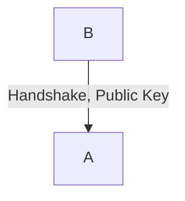
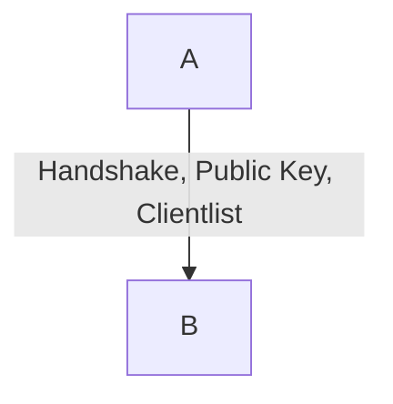
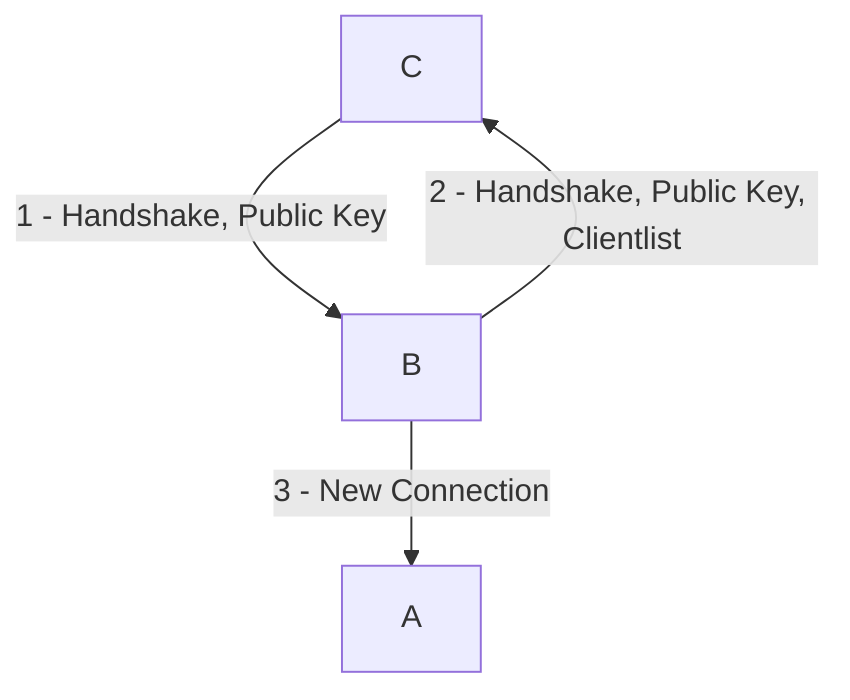
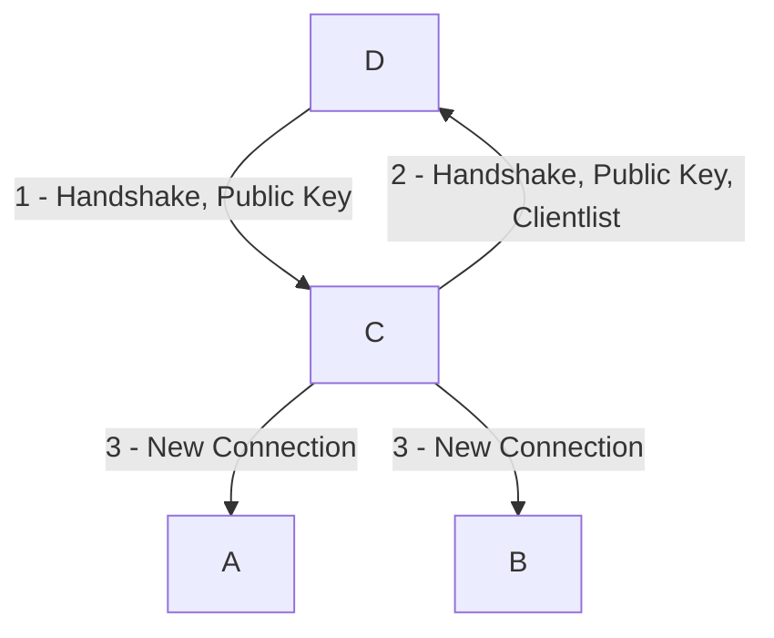

# Mithrundeal 

P2P Encrypted Local Connection Protocol

## Connection Mesh 

```mermaid
graph TD;
    B-- Handshake, Public Key -->A;            
```

```mermaid
graph TD;    
    A-- Handshake, Public Key, Clientlist -->B;          
```

```mermaid
graph TD;    
    C-- 1 - Handshake, Public Key -->B;
    B-- 2 - Handshake, Public Key, Clientlist -->C;
    B-- 3 - New Connection -->A;                                
```

```mermaid
graph TD;    
    D-- 1 - Handshake, Public Key -->C;
    C-- 2 - Handshake, Public Key, Clientlist -->D;
    C-- 3 - New Connection -->A;
    C-- 3 - New Connection -->B;                                
```

